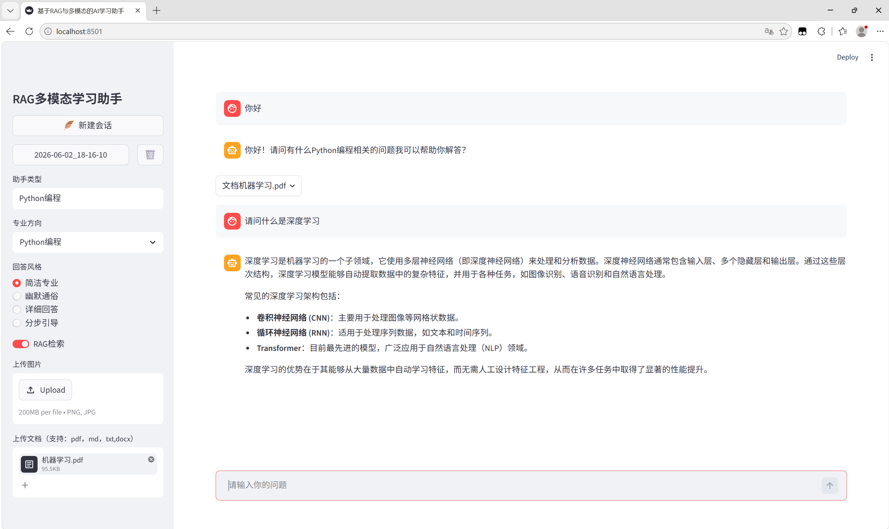

# RAG-Study-Assistant

项目简介
RAG-Study-Assistant 是一个面向学习资料问答场景的 AI 学习助手项目。用户可以上传 PDF、TXT、MD、DOCX 等学习资料，系统会对文档内容进行解析、切分、向量化存储，并在用户提问时从知识库中检索相关片段，再结合大语言模型生成回答。
这个项目的核心目标不是单纯做一个聊天机器人，而是让 AI 能围绕用户自己的学习资料进行问答，适合课程资料、学习笔记、技术文档等场景。项目前端使用 Streamlit 实现交互界面，后端逻辑拆分为大模型调用、RAG 检索、多模态输入处理、MySQL 数据管理等模块，后续可以继续扩展为前后端分离的 AI 应用。

项目效果展示
RAG 知识库问答效果


项目定位

本项目主要围绕“AI 学习助手”这个方向展开，重点解决以下问题：
1. 用户上传学习资料后，系统能够基于资料内容进行问答。
2. 用户可以在普通对话和 RAG 知识库问答之间切换。
3. 系统能够保存不同会话对应的历史消息和知识库数据。
4. 项目结构尽量按照真实 AI 应用拆分，而不是把所有逻辑都写在一个文件中。
5. 后续可以继续接入 FastAPI、用户系统、Agent 工具调用和更完整的 RAG 优化。
目前项目仍在持续完善中，已经完成了基础 RAG 问答、文档上传、向量库持久化、会话管理和 MySQL 模块设计。

核心功能
1. 大模型对话
项目支持基础的大模型对话能力。用户在前端输入问题后，系统会调用大语言模型生成回答，并结合历史消息实现连续对话。
对话模块主要负责模型初始化、Prompt 构造、历史消息组织和模型响应生成。后续可以继续优化为独立后端接口，方便不同前端调用。

2. 文档上传与解析
项目支持用户上传学习资料，并对不同类型的文件进行解析。目前主要支持以下文档类型：
PDF
TXT
MD
DOCX


文档上传后，系统会读取文件内容，并将文档文本交给 RAG 模块进行后续处理。

3. RAG 知识库问答
RAG 是本项目的核心功能。上传文档后，系统会将文档内容切分为多个文本块，再通过 Embedding 模型转成向量，存入 ChromaDB 向量库。
用户提问时，系统会根据问题在向量库中检索相关文本片段，并将检索结果作为上下文传给大语言模型，让模型基于资料内容生成回答。
整体流程如下：
用户上传文档
      ↓
文档读取与解析
      ↓
文本切分
      ↓
Embedding 向量化
      ↓
存入 ChromaDB 向量库
      ↓
用户提出问题
      ↓
向量检索相关文本
      ↓
构造带上下文的 Prompt
      ↓
大语言模型生成回答
      ↓
前端展示结果

相比普通聊天，RAG 问答可以让模型回答更加贴合用户上传的资料，减少只依赖模型自身知识带来的偏差。

4. ChromaDB 向量库持久化

项目使用 ChromaDB 保存文档向量数据，并按照不同会话维护对应的向量库目录。这样做的好处是，用户上传过的资料可以被持久化保存，项目重新运行后不需要每次都重新处理同一批文档。

在删除会话时，系统也会同步清理对应的向量库目录，避免无效数据长期堆积。

5. 会话管理
项目支持会话级别的数据管理。每个会话都有对应的 session_id，用来关联前端显示消息、模型历史消息、配置参数和向量库路径。
当前会话管理主要包括：
创建新会话
加载历史会话
保存用户与助手消息
删除会话
删除会话时同步清理向量库

这个设计是为了让项目不只是一次性问答页面，而是具备基础的状态管理能力。

6. MySQL 数据管理
项目中设计了 MySQL 相关模块，用于后续替代本地文件存储，实现更加稳定的数据持久化管理。
MySQL 设计方向主要包括：
sessions：保存会话基础信息
ui_messages：保存前端展示消息
chat_history：保存传给大模型的历史消息
config：保存助手类型、专业方向、回答风格等配置

这样可以把 UI 展示消息和 LLM 历史消息分开管理，后续如果接入用户登录、多端访问或 FastAPI 后端，也更容易扩展。

7. 多模态输入处理

项目中单独拆分了多模态输入处理模块，用于处理文本、图片、文件等不同类型的输入。当前项目主要以文本和文档问答为主，多模态模块为后续扩展图片理解、文件混合问答等功能做准备。

技术栈
Python
Streamlit
LangChain
ChromaDB
MySQL
PyMySQL
OpenAI-compatible API
Embedding Model
RAG
Prompt Engineering

## 项目架构

项目整体采用模块化拆分，避免所有逻辑集中在一个文件中。当前主要分为前端交互层、模型调用层、RAG 检索层、多模态处理层和数据存储层。

```text
Streamlit 前端界面
        ↓
用户输入 / 文件上传 / 参数配置
        ↓
业务处理逻辑
        ↓
LLM 对话模块 / RAG 检索模块 / 多模态处理模块
        ↓
ChromaDB 向量库 / MySQL 数据库
        ↓
大语言模型生成回答
        ↓
前端展示结果
```

这种结构方便后续继续升级。例如，当前 Streamlit 可以直接调用各个模块；后续接入 FastAPI 后，可以将 AI 核心能力封装成接口，再由 Streamlit 或其他前端调用。

项目结构
RAG-Study-Assistant/
├── main.py                    # 项目主入口，负责启动整体应用
├── ui_streamlit.py             # Streamlit 前端页面，负责用户交互、文件上传、参数配置和消息展示
├── llm.py                      # 大语言模型调用模块，负责模型初始化、Prompt 构造和对话生成
├── RAG_.py                     # RAG 核心模块，负责文档加载、文本切分、向量化、向量库存储和检索
├── Multi_modal_process.py      # 多模态输入处理模块，负责文本、图片、文件等输入格式的统一处理
├── mysql_db.py                 # MySQL 数据库连接模块，负责数据库连接和基础 SQL 执行
├── mysql_message.py            # MySQL 消息管理模块，负责会话、UI 消息、LLM 历史消息等数据的存取
├── requirements.txt            # 项目依赖文件
├── .gitignore                  # Git 忽略文件，避免上传虚拟环境、密钥、缓存、向量库等内容
├── images/                     # 项目展示图片目录
│   └── demo_rag.png             # RAG 知识库问答效果截图
└── README.md                   # 项目说明文档


环境配置

1. 克隆项目

bash
git clone https://github.com/vipker/RAG-Study-Assistant.git
cd RAG-Study-Assistant
```

2. 创建虚拟环境

bash
python -m venv .venv


Windows 激活虚拟环境：

bash
.venv\Scripts\activate


3. 安装依赖

```bash
pip install -r requirements.txt
```

### 4. 配置环境变量

项目运行需要配置大模型 API Key、模型地址、数据库连接等信息。建议在项目根目录下创建 `.env` 文件保存敏感配置。

示例：

```env
API_KEY=your_api_key
BASE_URL=your_base_url
MODEL_NAME=your_model_name

MYSQL_HOST=localhost
MYSQL_PORT=3306
MYSQL_USER=root
MYSQL_PASSWORD=your_password
MYSQL_DATABASE=rag_study_assistant
```

注意：`.env` 文件包含密钥和数据库密码，不能上传到 GitHub。项目中的 `.gitignore` 已经将 `.env` 排除。

## 项目运行

如果项目入口是 `main.py`，可以使用：

```bash
streamlit run main.py
```

如果使用 `ui_streamlit.py` 作为前端入口，可以使用：

```bash
streamlit run ui_streamlit.py
```

运行后，浏览器会打开 Streamlit 页面，用户可以在页面中进行对话、上传文档、开启 RAG 检索并查看模型回答。

## 项目亮点

### 1. 不是简单 API 调用，而是完整 RAG 流程

项目不是只调用大语言模型 API 生成回答，而是实现了从文档上传、文本切分、向量化、向量库存储、相似度检索到上下文增强生成的完整 RAG 流程。

### 2. 支持向量库持久化

使用 ChromaDB 保存文档向量数据，不需要每次启动项目都重新构建知识库。不同会话可以维护不同的向量库目录，方便后续扩展多知识库管理。

### 3. 会话和知识库数据有关联

项目通过 session_id 管理会话，并将会话历史和向量库目录进行关联。删除会话时，可以同步清理对应向量库，避免数据混乱。

### 4. 项目结构做了模块化拆分

项目将前端页面、大模型调用、RAG 处理、多模态输入和数据库操作拆成不同模块，降低了代码耦合度，也方便后续接入 FastAPI 或继续优化单个模块。

### 5. 引入 MySQL 进行数据管理升级

项目已经设计 MySQL 相关模块，用于管理会话、UI 消息、LLM 历史消息和配置数据。相比只依赖内存或本地文件，MySQL 更适合后续扩展用户系统和多端访问。

## 当前进度

已完成的部分：

```text
基础大模型对话
Streamlit 前端交互
文档上传与解析
RAG 检索问答
ChromaDB 向量库持久化
会话管理设计
MySQL 数据管理模块
多模态输入处理模块
GitHub 项目托管
```

正在完善或计划优化的部分：

```text
FastAPI 后端接口化
MySQL 会话管理进一步完善
RAG 检索效果优化
检索结果引用片段展示
Rerank 模块接入
Agent 工具调用能力
用户登录与用户级知识库管理
项目部署与在线演示
```

## 后续优化方向

后续项目会优先从工程化和 RAG 效果两个方向继续优化。

工程化方面，计划接入 FastAPI，将对话、文档上传、RAG 问答、会话管理等能力封装为后端接口，让 Streamlit 只负责前端展示。这样项目结构会更接近真实业务开发，也方便后续替换为 Vue 或 React 前端。

数据管理方面，计划进一步完善 MySQL 会话管理，让 sessions、ui_messages、chat_history 和 config 等数据都通过数据库持久化保存，减少对本地文件的依赖。

RAG 效果方面，计划增加检索片段展示、TopK 参数调整、Rerank 重排序、检索为空提示等功能，让回答过程更加可解释，也方便用户判断模型回答是否来自上传资料。

功能扩展方面，后续可以继续加入 Agent 工具调用能力，让助手不只回答问题，也能执行一些学习辅助任务，例如资料总结、知识点整理、生成复习计划等。

## 项目总结

RAG-Study-Assistant 是一个围绕学习资料问答场景构建的 AI 应用项目。通过这个项目，我实践了大模型应用开发中的基础流程，包括 Prompt 构造、文档解析、文本切分、Embedding 向量化、向量检索、RAG 问答、历史消息管理、向量库持久化和数据库模块设计。

目前项目还不是完整的企业级应用，但已经具备了 AI 学习助手的核心功能和基础工程结构。后续会继续围绕 FastAPI 接口化、MySQL 持久化、RAG 检索优化和 Agent 能力扩展进行完善。
